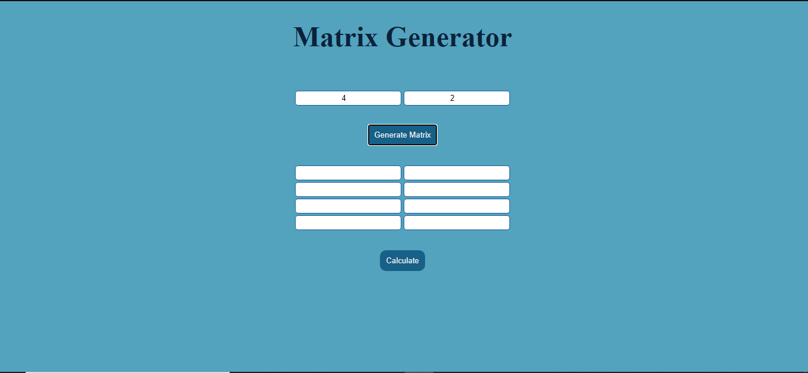

# JS-Matrix

An application that receives N and M, and creates an array of inputs, that only receives whole numbers. Validate that each sum of each row and column is always 100.
[JS atrix Web Site](https://jsmatrixyoyman.netlify.app/) <-- Go to visit  

# Instructions

Enter the number of rows and columns to generate the matrix and then enter the sum values ​​in each cell.

## Author ✒️

_Developed by_

**Yoyman Castellar** :computer: :man: 

- Github - [ymcastellar](https://github.com/ymcastellar)
- Twitter - [@CastellarYoyman](https://twitter.com/CastellarYoyman)
- LinkedIn - [yoyman-castellar](https://www.linkedin.com/in/yoyman-castellar/)
